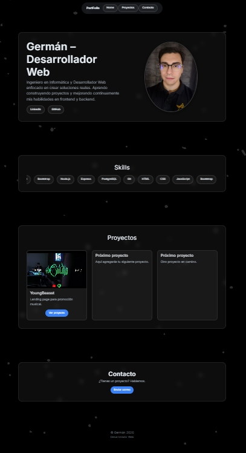

# 💼 Portafolio Web - Germán Mundaca

Desarrollador web enfocado en la creación de soluciones funcionales y proyectos reales.  
Este portafolio refleja mi aprendizaje basado en práctica y mejora continua.

---

## 🚀 Tecnologías utilizadas

- HTML5
- CSS3
- JavaScript
- Bootstrap 5
- Node.js
- Express
- PostgreSQL
- Git & GitHub

---

## 🎯 Sobre este proyecto

Este portafolio fue creado para:

- Mostrar mis habilidades como desarrollador web
- Presentar proyectos reales
- Aplicar buenas prácticas de diseño
- Construir una interfaz clara y funcional

---

## 🌐 Demo

👉 https://germanmundaca.github.io/PortFolio/

---

## 📷 Preview

---

## 📌 Características

- Diseño responsive
- Interfaz moderna
- Sección de proyectos
- Animaciones en skills
- Integración con redes profesionales

---

## 📬 Contacto

- LinkedIn: https://www.linkedin.com/in/german-dev/
- GitHub: https://github.com/GermanMundaca

---

## 📚 Estado del proyecto

En constante mejora 🚀

---

## 🧠 Aprendizajes

- Uso de HTML, CSS y Bootstrap
- Diseño de interfaces modernas
- Control de versiones con Git
- Resolución de conflictos en GitHub

---

## ⚡ Próximas mejoras

- Agregar nuevos proyectos
- Mejorar animaciones
- Optimización móvil
